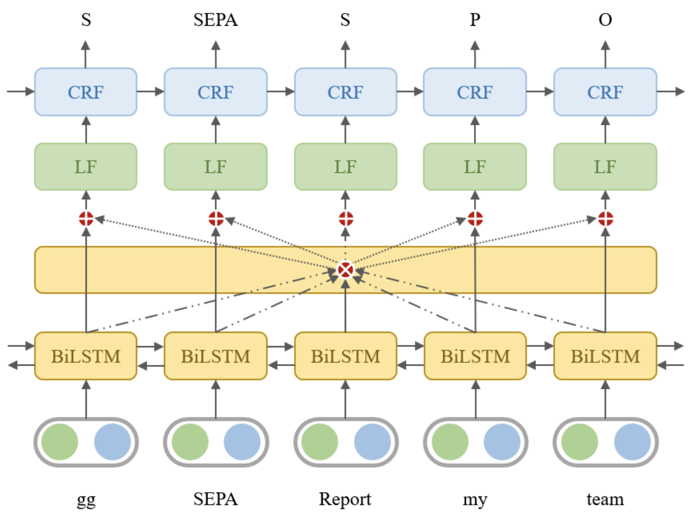

# Toxic Language Detection

**Abstract.**
In-game toxic language becomes the hot potato in the gaming industry and community. 
There have been several online game toxicity analysis frameworks and models proposed. 
However, it is still challenging to detect toxicity due to the nature of in-game chat, which has extremely short length. 
To address this, the project introduces the best model for toxic language token tagging (slot filling) from the real-world in-game chat data. 



## Model

**BRAR (Bi-directional Representations with Attention Residuals)** integrates:
- Bi-LSTM for feature extraction
- Attention residuals for global information
- Label forcing for prediction enhancement
- CRF for sequence labeling

## Dataset

Using the CONDA dataset with 6 slot labels:
- **T**: Toxicity
- **C**: Character
- **D**: Dota-specific
- **S**: Game Slang
- **P**: Pronoun
- **O**: Other

## Usage

```bash
python src/brar.py
```

## Project Structure

```
toxic-language-detection/
├── data/              # CONDA dataset
│   ├── train.csv
│   ├── val.csv
│   └── CONDA_test_original.csv
├── image/             # Model architecture diagram
│   └── brar.png
├── src/
│   └── brar.py        # BRAR model implementation
├── requirements.txt   # Python dependencies
├── .gitignore
└── README.md
```
