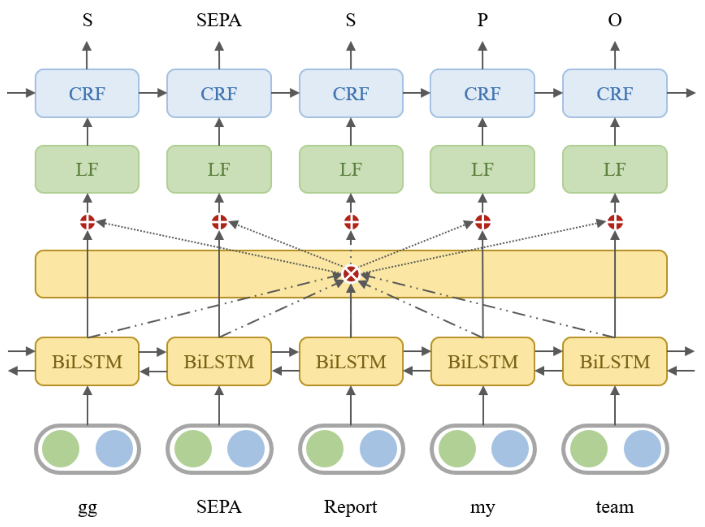

# Toxic Language Detection

**Abstract.**
In-game toxic language has emerged as a critical concern in the gaming industry and community. 
While several frameworks and models for online game toxicity analysis have been proposed, detecting toxicity in player chat utterances remains a formidable challenge: stemming not only from the extremely short length of such utterances but also from the heavy reliance on game slang, abbreviations, and domain-specific jargon, which generic language models are poorly suited to recognize. 
This project introduces the best-preforming model for the in-game toxic language detection from the real-world in-game chat data. 


## Model

**BRAR (Bi-directional Representations with Attention Residuals)** integrates:
- BiLSTM for feature extraction
- Attention residuals for global information
- Label forcing for prediction enhancement
- CRF for sequence labeling

## Dataset

Using the CONDA dataset with 6 slot labels:
- **T**: Toxicity
- **C**: Character
- **D**: Dota-specific
- **S**: Game Slang
- **P**: Pronoun
- **O**: Other

## Usage

```bash
python src/brar.py
```

## Project Structure

```
toxic-language-detection/
├── data/              # CONDA dataset
│   ├── train.csv
│   ├── val.csv
│   └── CONDA_test_original.csv
├── image/             # Model architecture diagram
│   └── brar.png
├── src/
│   └── brar.py        # BRAR model implementation
├── requirements.txt   # Python dependencies
├── .gitignore
└── README.md
```
